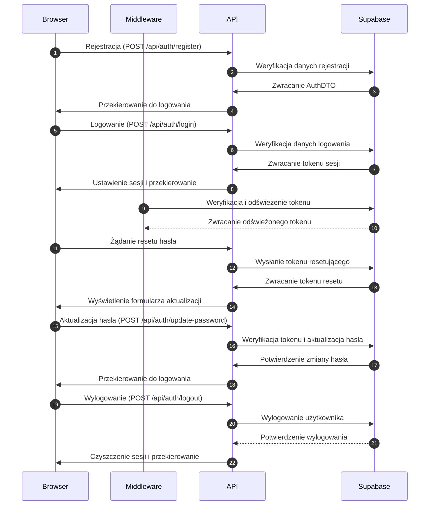

<authentication_analysis>
Opis przepływu autentykacji:
1. Rejestracja: Użytkownik wprowadza dane rejestracji, które są
   walidowane po stronie frontend (Zod schema) i wysyłane do
   endpointu API (/api/auth/register). Supabase Auth przetwarza
   rejestrację i zwraca dane sesji (AuthDTO).
2. Logowanie: Użytkownik używa formularza logowania, gdzie jego
   dane są weryfikowane przez API (/api/auth/login) i Supabase Auth.
   Po poprawnym logowaniu, sesja jest ustawiana, a middleware
   monitoruje ważność tokenu oraz automatycznie go odświeża.
3. Reset hasła: Użytkownik inicjuje reset hasła, otrzymuje token resetu,
   a następnie poprzez formularz aktualizacji hasła (/api/auth/update-password),
   jego hasło jest zmieniane po weryfikacji tokenu.
4. Wylogowanie: Żądanie wylogowania (/api/auth/logout) powoduje
   wyczyszczenie sesji przez Supabase Auth, a użytkownik jest
   przekierowywany na stronę główną.
Główni aktorzy: Przeglądarka, Middleware, Astro API oraz Supabase Auth.
</authentication_analysis>

<mermaid_diagram>

</mermaid_diagram> 