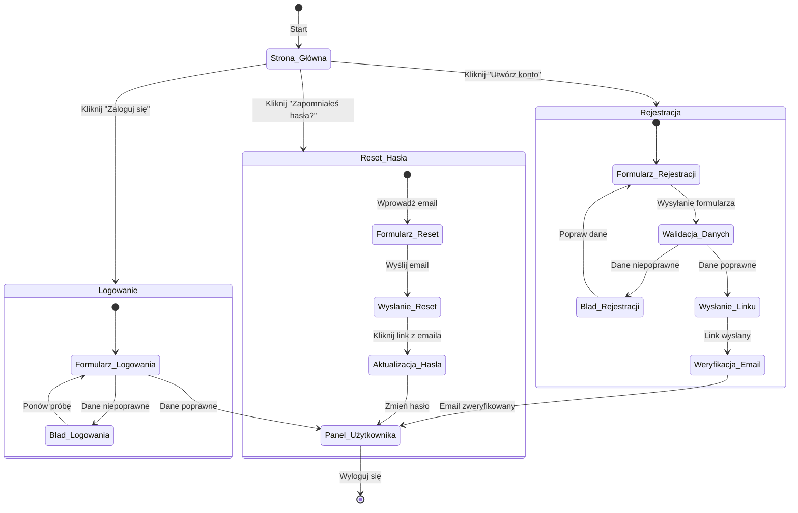

<user_journey_analysis>
Analiza podróży użytkownika w kontekście modułu autentykacji:
1. Ścieżki użytkownika na podstawie dokumentacji PRD i specyfikacji autentykacji:
   - Przeglądanie audytów na stronie głównej (dostęp publiczny) bez konieczności logowania.
   - Akcje wymagające uwierzytelnienia (dodawanie/edycja audytu) skutkują przekierowaniem do strony logowania.
   - Użytkownik ma możliwość wyboru: logowania, rejestracji lub odzyskania hasła.
2. Główne podróże i stany:
   - Podróż logowania:
     • Przejście ze Strony Głównej do Formularza Logowania.
     • Weryfikacja danych: w przypadku błędnych danych pojawia się komunikat, a użytkownik ma możliwość ponownej próby, w przypadku poprawnych następuje przekierowanie do Panelu Użytkownika.
   - Podróż rejestracji:
     • Przejście ze Strony Głównej do Formularza Rejestracji.
     • Weryfikacja i walidacja danych: przy błędach użytkownik wraca do formularza, przy sukcesie następuje wysłanie linku weryfikacyjnego.
     • Po weryfikacji email użytkownik trafia do Panelu Użytkownika.
   - Podróż odzyskiwania hasła:
     • Użytkownik wybiera opcję "Zapomniałeś hasła?" na Stronie Głównej, co prowadzi do formularza resetowania hasła.
     • Po wysłaniu emaila, użytkownik klikając link, przechodzi do Formularza Aktualizacji Hasła.
     • Po zmianie hasła następuje przekierowanie do Panelu Użytkownika.
3. Punkty decyzyjne:
   - Wybór: logowanie, rejestracja lub reset hasła.
   - Walidacja formularzy – błąd vs. dane poprawne.
4. Opis stanów:
   - Strona Główna: Miejsce startowe, gdzie użytkownik przegląda audyty.
   - Formularz Logowania: Pozwala na wprowadzenie danych logowania.
   - Formularz Rejestracji: Umożliwia założenie nowego konta.
   - Formularz Resetowania Hasła: Pozwala na wprowadzenie emaila do resetu hasła.
   - Formularz Aktualizacji Hasła: Umożliwia ustawienie nowego hasła po kliknięciu linku resetującego.
   - Panel Użytkownika: Dostępny po pomyślnym uwierzytelnieniu, zawiera główne funkcje aplikacji.
</user_journey_analysis>

<mermaid_diagram>

</mermaid_diagram> 