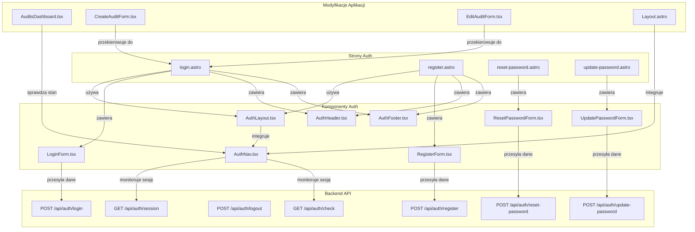

<architecture_analysis>
Analiza modułu autentykacji:
1. Komponenty wymienione:
   - Strony Astro (src/pages/auth):
     • login.astro – strona logowania, wykorzystuje formularz logowania, nagłówek, stopkę i layout autentykacji.
     • register.astro – strona rejestracji, wykorzystuje formularz rejestracji, nagłówek i stopkę.
     • reset-password.astro – strona resetowania hasła, zawiera formularz resetowania.
     • update-password.astro – strona aktualizacji hasła, zawiera formularz aktualizacji.
   - Komponenty React (src/components/auth/):
     • LoginForm.tsx – formularz logowania, przesyła dane do endpointu /api/auth/login.
     • RegisterForm.tsx – formularz rejestracji, przesyła dane do endpointu /api/auth/register.
     • ResetPasswordForm.tsx – formularz resetowania hasła, wysyła dane do /api/auth/reset-password.
     • UpdatePasswordForm.tsx – formularz aktualizacji hasła, wysyła dane do /api/auth/update-password.
     • AuthHeader.tsx – wyświetla nagłówek sekcji autentykacji z logo i opisem.
     • AuthFooter.tsx – stopka z linkami pomocniczymi.
     • AuthLayout.tsx – wspólny layout dla stron auth, integruje nagłówek, stopkę i nawigację.
     • AuthNav.tsx – komponent nawigacji (przyciski logowania/wylogowania) umieszczony w prawym górnym rogu.
   - Modyfikacje w innych częściach aplikacji:
     • AuditsDashboard.tsx – obsługa stanu autentykacji, ukrywanie opcji edycji i usuwania dla niezalogowanych.
     • CreateAuditForm.tsx i EditAuditForm.tsx – przekierowanie do /auth/login, gdy użytkownik nie jest zalogowany.
     • Layout.astro – integracja komponentu AuthNav, umożliwiająca wyświetlanie stanu sesji.
2. Główne strony i odpowiadające im komponenty:
   - Strona logowania: login.astro korzysta z LoginForm.tsx, AuthHeader.tsx, AuthFooter.tsx oraz AuthLayout.tsx.
   - Strona rejestracji: register.astro korzysta z RegisterForm.tsx, AuthHeader.tsx, AuthFooter.tsx oraz AuthLayout.tsx.
   - Strona resetowania hasła: reset-password.astro korzysta z ResetPasswordForm.tsx.
   - Strona aktualizacji hasła: update-password.astro korzysta z UpdatePasswordForm.tsx.
3. Przepływ danych między komponentami:
   - Użytkownik wprowadza dane w formularzach (LoginForm, RegisterForm, etc.), które są przesyłane do odpowiednich endpointów backendowych (/api/auth/*).
   - Stan autentykacji (np. za pomocą hooka useSession) jest monitorowany i wykorzystywany przez komponenty takie jak AuditsDashboard i AuthNav.
   - Komponenty layout (AuthLayout i Layout.astro) łączą prezentację oraz nawigację, zapewniając spójny interfejs.
4. Funkcjonalności poszczególnych komponentów:
   - Formularze: Zbierają dane użytkownika, walidują je i komunikują się z API autentykacji.
   - AuthHeader i AuthFooter: Zapewniają spójność wizualną i informacje pomocnicze.
   - AuthNav: Monitoruje stan sesji, umożliwiając logowanie i wylogowywanie, oraz przekierowuje niezalogowanych użytkowników.
</architecture_analysis>

<mermaid_diagram>

</mermaid_diagram> 